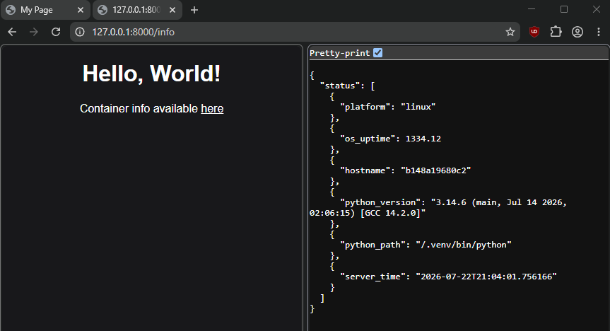

Containerized local website with a FastAPI backend. Nothing special, just some example

## Screenshots



## Requirements

- [Podman](https://podman.io/) / [Docker](https://www.docker.com/) installed

## Installation

1.  Clone this repo:
    
    ```
    git clone https://github.com/dayyakav/container-site.git
    ```
    
2.  Build container:
    
    ```
    podman build -t my-app .
    ```
    
3.  Run:
    
    ```
    podman run -p 8000:8000 my-app
    ```
    
4.  Go to http://127.0.0.1:8000
